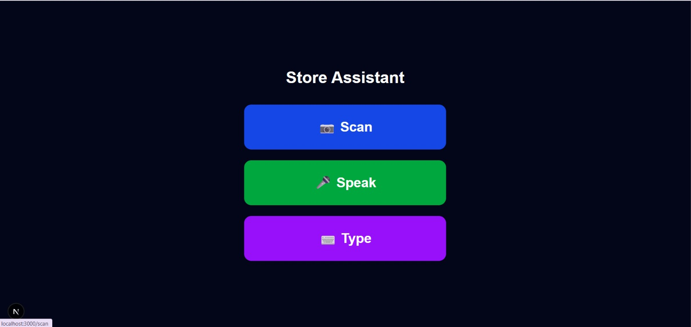
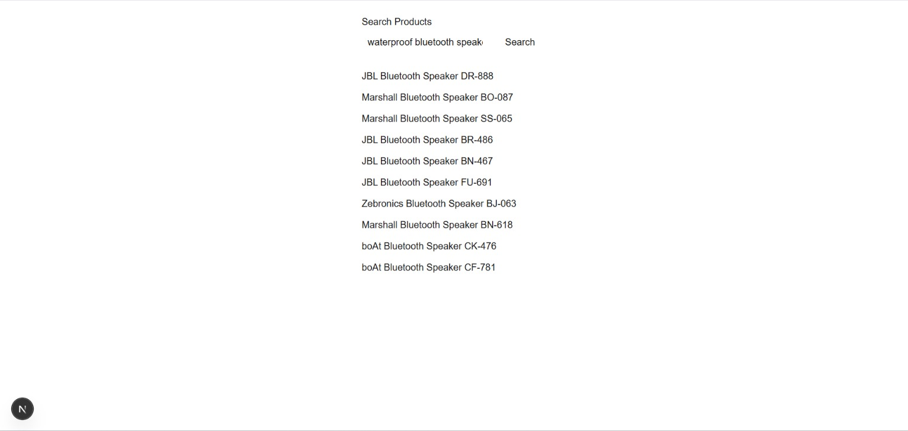
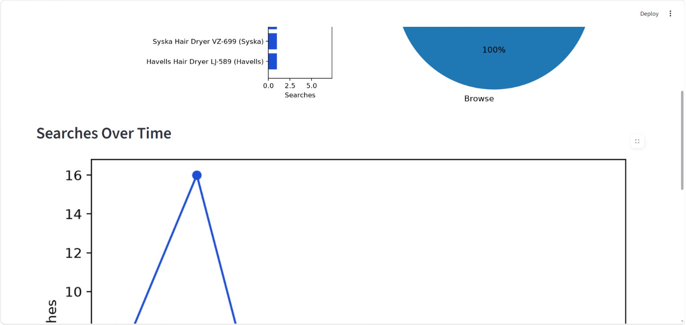
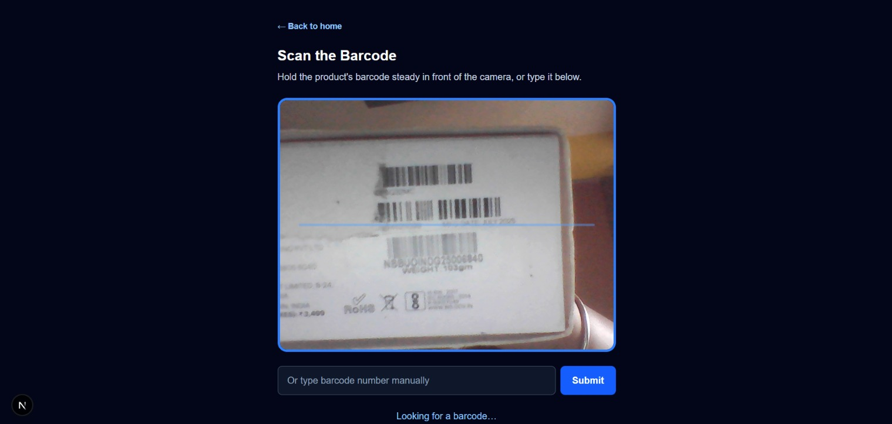
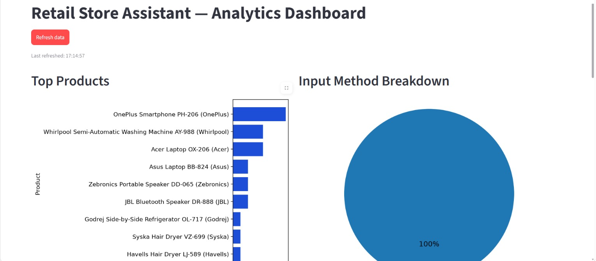

# Store Assistant — Semantic Retail Search & Analytics Platform
**Live Demo:** [store-assistant-plum.vercel.app](https://store-assistant-plum.vercel.app)

A full-stack retail electronics store assistant designed for non-technical users. Customers and employees can search a 5,000-product catalog using natural language, barcode scanning, or voice — even when they don't know exact product names or specs. Built as a data analyst / technical analyst portfolio project 

> **Note:** The 5,000-product catalog is synthetically generated (via Faker + a seed script) for demonstration purposes — not scraped or real store inventory.

## Features

- **Multi-modal search** — scan a barcode for exact catalog lookup, or speak/type a query for semantic search powered by sentence embeddings + FAISS
- **Feature-based search** — type loose, imprecise keywords (e.g. "5g 8gb ram" or "waterproof speaker") and get relevant matches by product specs, not just exact names, powered by sentence embeddings + FAISS
- **Price-match tool** — customers can request a competitor price match; backend validates against a 15% max discount floor and logs the decision
- **Analytics dashboard** — a Streamlit dashboard tracks searched products, search input method, search volume over time, and zero-result queries, to support real business decisions
- **Grandmother-friendly UI** — large buttons, minimal text, built for non-technical users

 ## Screenshots

| Homepage | Search & Results |
|---|---|
|  |  |
| Scan / Voice | Analytics Dashboard |
|---|---|
|  |  |

**Barcode Scan:**



**Dashboard (more views):**




### Business Insight Example

Out of 26 tracked searches, "phone" and "laptop" were the most searched terms (5 each), followed by "washing machine" (4) — indicating strong customer interest in electronics and appliances. Zero-result searches were 0% in this sample, suggesting the semantic search successfully matches customer queries to catalog items even with varied phrasing.


## Search Evaluation

To validate the retrieval approach, three search methods were benchmarked against 30 manually judged test queries spanning exact-spec, paraphrased, vague/category, price-constrained, and no-result cases (see `eval/relevance_judgments.jsonl` — each query's relevant product IDs were determined by manually inspecting live search results and applying a stated relevance rule per query).

| Method | Precision@5 | Recall@5 | MRR |
|---|---|---|---|
| Keyword Search | 0.017 | 0.008 | 0.019 |
| TF-IDF | 0.033 | 0.029 | 0.029 |
| FAISS + Embeddings | **0.625** | **0.499** | **0.783** |

**Findings:** FAISS + embeddings substantially outperforms both keyword and TF-IDF search on manually judged relevance — keyword and TF-IDF methods essentially fail to surface relevant products for natural-language queries, while semantic search returns relevant results in the top 5 for the majority of queries. Notable exceptions found during judging: price constraints (e.g. "laptop under 50000") are not currently enforced as filters, and a few queries mixing product categories (e.g. "phone with good camera") return the wrong category entirely — both are tracked as known limitations.

Run the evaluation yourself: `python -m eval.evaluate_search` (from project root).


## Performance & Scalability

Latency was benchmarked on the current 5,000-product catalog to break down where time is spent in the search pipeline.

| Catalog Size | Query Embedding | FAISS Search | DB Fetch | Total (end-to-end) |
|---|---|---|---|---|
| 5,000 | 13.16 ms | 0.70 ms | 47.70 ms | 61.57 ms |

**Findings:** DB fetch currently dominates latency (up to 77% of total time), while FAISS search itself is fast (`IndexFlatL2` brute-force scan over 5,000 vectors). At larger catalog sizes, FAISS search time would grow roughly linearly (expected for `IndexFlatL2`), and DB fetch could be optimized with indexing or batching — this hasn't yet been benchmarked at scale beyond the current catalog.

Run this benchmark yourself: `python -m eval.benchmark_performance`

## Tech Stack

| Layer | Technology |
|---|---|
| Frontend | Next.js 15.5.9, React 19, TypeScript, Tailwind CSS |
| Backend | FastAPI (Python) |
| Database | PostgreSQL 17 |
| Search | fastembed (`all-MiniLM-L6-v2`, ONNX runtime) + FAISS |
| Analytics | Streamlit + pandas |
| Barcode | @zxing/browser |
| Voice | Web Speech API |

## Architecture

Frontend never talks to the database directly — all requests go through the FastAPI backend. Search logic (embedding + FAISS lookup) is isolated in its own module so it can be swapped or upgraded independently. See `ARCHITECTURE.md` for details.

## Getting Started

### Prerequisites
- Node.js 18+
- Python 3.11+
- PostgreSQL 17


### 1. Clone and install
```bash
git clone https://github.com/ANCHAL23-WEB/store-assistant.git
cd store-assistant

# Backend
cd backend
pip install -r requirements.txt --break-system-packages

# Frontend
cd ../frontend
npm install
```

### 2. Set up the database
Create a `.env` file in both the project root and `backend/` with:


Copy the example env files and fill in your own PostgreSQL credentials:

```bash
cp .env.example .env
cp backend/.env.example backend/.env
```

Each `.env` needs: